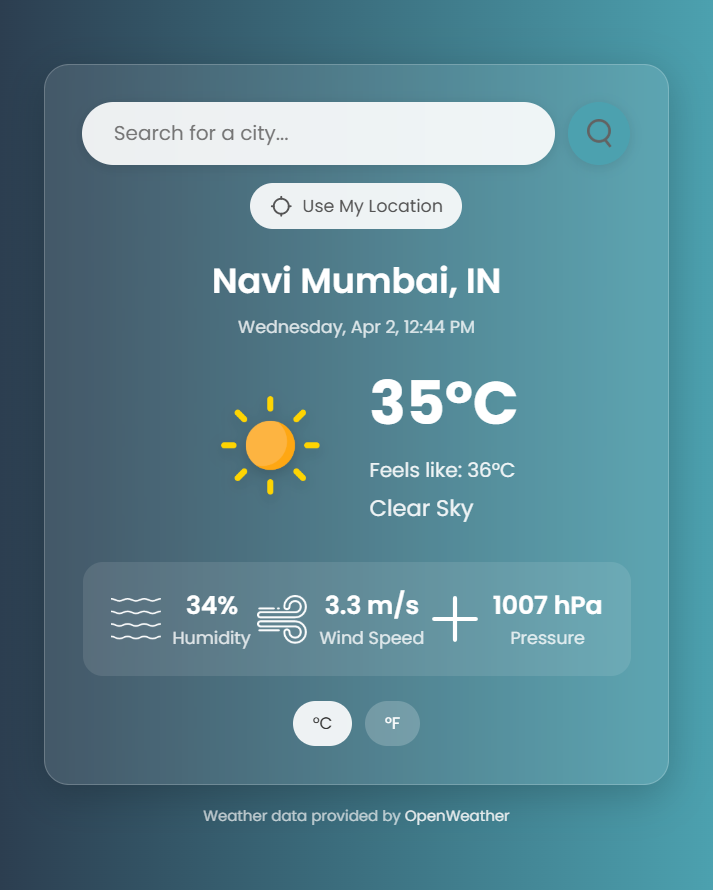

# Weather Forecast App

A modern, responsive weather application that provides real-time weather information for locations worldwide.



## 🌟 Features

- **Real-time Weather Data**: Access current weather conditions using the OpenWeatherMap API
- **Location-based Weather**: Get weather for your current location with one click
- **City Search**: Look up weather information for any city around the world
- **Temperature Unit Toggle**: Switch between Celsius and Fahrenheit
- **Responsive Design**: Works seamlessly on desktop and mobile devices
- **Visual Weather Indicators**: Icons representing different weather conditions
- **Key Weather Metrics**: Temperature, humidity, wind speed, and atmospheric pressure

## 📋 Technologies Used

- **HTML5**: Structure and content
- **CSS3**: Styling with modern features (flexbox, animations, gradients)
- **JavaScript**: Dynamic functionality and API integration
- **OpenWeatherMap API**: Real-time weather data
- **Geolocation API**: Location-based services

## 🚀 Live Demo

Check out the live demo of the application [here](https://dnyanesh182.github.io/SkyCast/).

## 🔧 Setup and Installation

1. **Clone the repository**

   ```bash
   git clone https://github.com/yourusername/weather-forecast-app.git
   cd weather-forecast-app
   ```

2. **Open in a web browser**

   - Simply open the `index.html` file in your preferred browser
   - Alternatively, use a local development server

3. **API Key Configuration**
   - The app uses a preloaded API key for OpenWeatherMap
   - For production use, consider getting your own free API key from [OpenWeatherMap](https://openweathermap.org/api)
   - Replace the API key in `script.js`:
     ```javascript
     const apiKey = "your_api_key_here";
     ```

## 📁 Project Structure

```
/
├── index.html          # Main HTML document
├── script.js           # JavaScript functionality
├── style.css           # CSS styling
├── images/             # Weather icons and UI elements
│   ├── clear.png
│   ├── clouds.png
│   ├── drizzle.png
│   ├── humidity.png
│   ├── mist.png
│   ├── rain.png
│   ├── search.png
│   ├── snow.png
│   └── wind.png
└── README.md           # Project documentation
```

## 📱 Responsive Design

The application is fully responsive with specific optimizations for:

- Mobile devices (portrait and landscape)
- Tablets
- Desktop displays

## 🔍 Future Enhancements

- Weather forecast for upcoming days
- Historical weather data
- Weather alerts and notifications
- Additional weather metrics
- Multiple location saving
- Dark/light theme toggle

## 📝 License

This project is open source and available under the [MIT License](LICENSE).

## 🙏 Acknowledgements

- Weather data provided by [OpenWeatherMap](https://openweathermap.org/)
- Icons and design inspiration from various open source weather applications
- Font by Google Fonts

## 👨‍💻 Author

Your Name - [GitHub Profile](https://github.com/Dnyanesh182)

---

Feel free to fork this project and enhance it with your own features! If you find any issues or have suggestions for improvements, please open an issue or submit a pull request.
